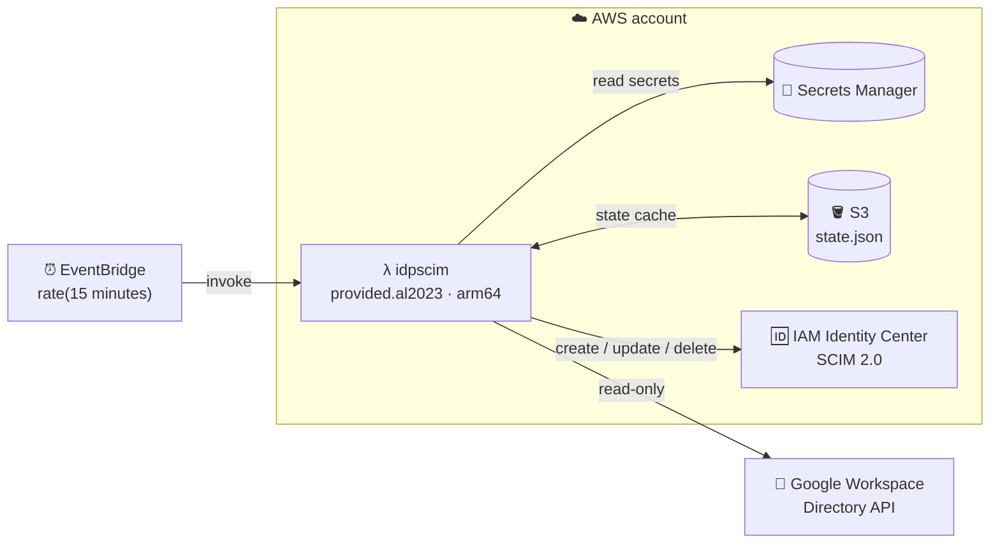

# 🆔 idp-scim-sync

[](https://bestpractices.coreinfrastructure.org/projects/5348)
[](https://securityscorecards.dev/viewer/?uri=github.com/slashdevops/idp-scim-sync)
[](https://github.com/slashdevops/idp-scim-sync/actions/workflows/build.yml)

[](https://goreportcard.com/report/github.com/slashdevops/idp-scim-sync)
[](https://github.com/slashdevops/idp-scim-sync/blob/main/LICENSE)
[](https://github.com/slashdevops/idp-scim-sync/actions/workflows/release.yml)
[](https://github.com/slashdevops/idp-scim-sync/releases)
[](https://codecov.io/gh/slashdevops/idp-scim-sync)

Keep your [AWS IAM Identity Center](https://aws.amazon.com/iam/identity-center/) (formerly AWS SSO) in sync with your [Google Workspace](https://workspace.google.com/) directory using an [AWS Lambda function](https://aws.amazon.com/lambda/). 🚀


## ✨ Features

* ✅ **Extended Attribute Support**: Syncs extended AWS SSO SCIM API fields as described in the [official documentation](https://docs.aws.amazon.com/singlesignon/latest/developerguide/limitations.html).
* ✅ **Configurable User Fields**: Choose which optional user attributes (phone numbers, addresses, enterprise data, etc.) to sync. See [Configurable User Fields](#configurable-user-fields) for details.
* ✅ **Efficient Data Retrieval**: Uses [partial responses](https://cloud.google.com/storage/docs/json_api#partial-response) from the Google Workspace API to fetch only the data you need.
* ✅ **Nested Groups Support**: Supports nested groups in Google Workspace thanks to the `includeDerivedMembership` API query parameter.
* ✅ **Multiple Deployment Options**: Can be deployed via the `AWS Serverless Application Repository`, as a `Container Image`, or as a `CLI`.
* ✅ **Incremental Sync**: Drastically reduces the number of requests to the AWS SSO SCIM API by using a [state file](docs/State-File-example.md) to track changes.

## 🆕 What's New

For a detailed list of new features, improvements, and bug fixes in each release, see the [What's New](docs/Whats-New.md) page.

## ⚡ Quick Start

The fastest path to a working sync:

1. **Google Workspace** — create a service account, download its JSON key, and grant it domain-wide
   delegation for the three `admin.directory.*.readonly` scopes.
2. **AWS** — enable IAM Identity Center, turn on automatic provisioning, and copy the SCIM endpoint
   and access token.
3. **Deploy** — from the [AWS Serverless Application Repository](https://serverlessrepo.aws.amazon.com/applications/us-east-1/889836709304/idp-scim-sync), or with `sam deploy --guided`.
4. **Verify before it writes anything** — `idpscimcli` is read-only:

   ```bash
   idpscimcli gws groups list --gws-groups-filter 'name:AWS*' \
     --gws-user-email admin@example.com \
     --gws-service-account-file ./credentials.json
   ```

5. **Watch the first run** in CloudWatch Logs. It is the slow one; every later run compares hashes and
   usually issues no writes at all.

📘 Step-by-step, with troubleshooting: **[User Manual](docs/User-Manual.md)**.

## 🧩 Compatibility

This project is compatible with the latest AWS Lambda runtimes. Since version `v0.0.19`, it uses the `provided.al2` runtime and `arm64` architecture.

| Version Range          | AWS Lambda Runtime | Architecture       | Deprecation Date |
| ---------------------- | ------------------ | ------------------ | ---------------- |
| `<= v0.0.18`           | Go 1.x             | amd64 (Intel)      | 2023-12-31       |
| `>= v0.0.19 < v0.31.0` | provided.al2       | arm64 (Graviton 2) | 2026-06-30       |
| `>= v0.31.0`           | provided.al2023    | arm64 (Graviton 2) | 2029-06-30       |

## ⚙️ How It Works

The AWS Lambda function is triggered by a CloudWatch event rule (every 15 minutes by default). It syncs your AWS IAM Identity Center with your Google Workspace directory using their respective APIs.

During the first sync, the data of your Groups and Users is stored in an AWS S3 bucket as a [state file](docs/State-File-example.md). This state file is a custom implementation to save time and requests to the AWS SSO SCIM API, and to mitigate some of its limitations.

This project is developed using the [Go language](https://go.dev/) and [AWS SAM](https://docs.aws.amazon.com/serverless-application-model/latest/developerguide/sam-specification.html).

For more details on the resources created by the CloudFormation template, please check the [AWS SAM Template documentation](docs/AWS-SAM-Template.md).

> **Note:** If this is your first time implementing AWS IAM Identity Center, please read [Using SSO](docs/Using-SSO.md).

## 🏗️ Architecture at a Glance

Google Workspace is the **source of truth** and is only ever read, using read-only scopes. AWS IAM
Identity Center is the replica that gets reconciled, and the S3 state file is a cache that lets the
sync skip work when nothing upstream has changed.



Every comparison is a hash comparison: each resource kind carries a hash covering only
Google-owned fields, so a run whose upstream data is unchanged short-circuits without issuing a
single SCIM write.

🏗️ Full detail, with diagrams of the sync algorithm, reconciliation model and hashing scheme:
**[Architecture](docs/Architecture.md)**.

## 🧰 Programs

This repository builds two binaries from the `cmd/` directory:

| Program | Source | Purpose |
| ------- | ------ | ------- |
| `idpscim` | `cmd/idpscim` | Main synchronization program that runs as the Lambda function, a local CLI, or a container command |
| `idpscimcli` | `cmd/idpscimcli` | Helper CLI used to inspect AWS SCIM and Google Workspace data while validating configuration |

After `make build`, the binaries are available in `build/`:

```bash
./build/idpscim --help
./build/idpscimcli --help
```

## 📚 Documentation

The repository documentation is organized as follows:

**Start here**

| Document | Purpose |
| ------- | ------- |
| 📘 [docs/User-Manual.md](docs/User-Manual.md) | **Deploying and operating** — prerequisites, setup path, verification, troubleshooting, upgrades |
| 🏗️ [docs/Architecture.md](docs/Architecture.md) | **How it works** — package topology, sync algorithm, reconciliation, hashing, concurrency, failure modes |
| 🛠️ [docs/Implementation-Guide.md](docs/Implementation-Guide.md) | **Changing the code** — invariants, adding a synced attribute, testing conventions, state-file compatibility |

**Reference**

| Document | Purpose |
| ------- | ------- |
| [docs/idpscim.md](docs/idpscim.md) | Main program reference for the `idpscim` sync executable |
| [docs/idpscimcli.md](docs/idpscimcli.md) | Command reference for the `idpscimcli` validation and inspection CLI |
| [docs/Configuration.md](docs/Configuration.md) | Configuration sources, examples, and environment variable usage |
| [docs/AWS-SAM.md](docs/AWS-SAM.md) | Source deployment, Serverless Application Repository update flow, and maintainer publishing workflow |
| [docs/AWS-SAM-Template.md](docs/AWS-SAM-Template.md) | Template parameters, generated resources, and Lambda environment mapping |
| [docs/Development.md](docs/Development.md) | Local development workflow, build steps, tests, and SAM-based cloud testing |
| [docs/Using-SSO.md](docs/Using-SSO.md) | Practical rollout guidance for AWS IAM Identity Center and Google Workspace group design |
| [docs/State-File-example.md](docs/State-File-example.md) | Example state file structure and notes about how sync state is stored |
| [docs/Demo.md](docs/Demo.md) | Visual walkthrough screenshots of the sync process and resulting AWS and Google Workspace data |
| [docs/Release.md](docs/Release.md) | Maintainer release flow based on semantic version tags and GitHub Actions |
| [docs/Whats-New.md](docs/Whats-New.md) | Release notes and notable changes across versions |

## 🚀 Getting Started

The easiest way to deploy and use this project is through the [AWS Serverless Application Repository](https://serverlessrepo.aws.amazon.com/applications/us-east-1/889836709304/idp-scim-sync).

### Credentials

You will need to configure credentials for both Google Workspace and AWS.

* **Google Workspace API Credentials**
  * Follow the [Google Workspace documentation](https://developers.google.com/workspace/guides/create-credentials) to create credentials.
  * You will need to create a **Service Account** and delegate **domain-wide authority** to it with the following scopes:
    * `https://www.googleapis.com/auth/admin.directory.group.readonly`
    * `https://www.googleapis.com/auth/admin.directory.user.readonly`
    * `https://www.googleapis.com/auth/admin.directory.group.member.readonly`

* **AWS SSO SCIM API Credentials**
  * Configure these credentials in the [AWS IAM Identity Center](https://aws.amazon.com/iam/identity-center/) service by following the [Automatic provisioning guide](https://docs.aws.amazon.com/singlesignon/latest/userguide/provision-automatically.html).

## 🛠️ Usage

You have several options to use this project:

### In AWS

* **AWS Serverless Application Repository (Recommended)**
  * Deploy the application directly from the [AWS Serverless Application Repository](https://serverlessrepo.aws.amazon.com/applications/us-east-1/889836709304/idp-scim-sync).
  * To update an existing deployment to a newer published version, reuse the same original application name that you entered when you first deployed it. Do not use the generated `serverlessrepo-...` stack name. See [docs/AWS-SAM.md](docs/AWS-SAM.md) for the full update flow.

* **AWS SAM**
  * Build and deploy the Lambda function from your local machine.
  * Quick start:

```bash
export AWS_PROFILE=<profile_name>
export AWS_REGION=<region>
GIT_VERSION=dev sam build
sam deploy --guided --stack-name idp-scim-sync --capabilities CAPABILITY_IAM CAPABILITY_NAMED_IAM
```

* For full validation, source deployment, publish, and update guidance, see [docs/AWS-SAM.md](docs/AWS-SAM.md) and [docs/AWS-SAM-Template.md](docs/AWS-SAM-Template.md).

### Locally

* **Build from Source**
  * Quick start:

```bash
make
./build/idpscim --help
./build/idpscimcli --help
```

* **Run the programs**
  * **idpscim** runs the actual synchronization logic.
  * **idpscimcli** helps you validate your AWS SCIM and Google Workspace configuration before enabling automated sync.
  * See [docs/idpscim.md](docs/idpscim.md), [docs/idpscimcli.md](docs/idpscimcli.md), [docs/Configuration.md](docs/Configuration.md), and [docs/Development.md](docs/Development.md) for examples, flags, and the full local workflow.

* **Pre-built Binaries**
  * Download the binaries from the [GitHub Releases](https://github.com/slashdevops/idp-scim-sync/releases).

* **Container Image**
  * Pull the image from the [GitHub Container Registry](https://github.com/slashdevops/idp-scim-sync/pkgs/container/idp-scim-sync).
  * Container build and execution details are documented in [docs/idpscim.md](docs/idpscim.md), [docs/idpscimcli.md](docs/idpscimcli.md), and [docs/Development.md](docs/Development.md).

## 🎛️ Configurable User Fields

By default, all optional user attributes are synced from Google Workspace to AWS SSO SCIM. You can control which optional fields are included using the `sync_user_fields` configuration option.

Supported optional fields include `phoneNumbers`, `addresses`, `title`, `preferredLanguage`, `locale`, `timezone`, `nickName`, `profileURL`, `userType`, and `enterpriseData`.

Required fields are always synchronized: `name`, `userName`, `displayName`, `emails`, and `active`.

For config file examples, environment variable usage, CLI flags, SAM parameter usage, and behavior notes, see [docs/Configuration.md](docs/Configuration.md) and [docs/idpscim.md](docs/idpscim.md).

## 📦 Repositories

* 📦 [AWS Serverless Application Repository](https://serverlessrepo.aws.amazon.com/applications/us-east-1/889836709304/idp-scim-sync)
* 📦 [GitHub Container Registry](https://github.com/slashdevops/idp-scim-sync/pkgs/container/idp-scim-sync)

## ⚠️ Limitations

* **Group Page Size**: The AWS IAM Identity Center SCIM `ListGroups` endpoint returns at most 100 groups per page. Since v0.45.0 this project walks every page via cursor-based pagination, so a larger directory no longer requires manual configuration.
* **Throttling**: With a very large number of users and groups, you may still encounter a `ThrottlingException` from the AWS IAM Identity Center SCIM API. The new member-resolution algorithm (one `members.value` query per user, see [docs/Whats-New.md](docs/Whats-New.md)) is roughly two orders of magnitude lighter than the old brute-force path, but the underlying SCIM endpoint is still rate-limited. This project uses the [httpx](https://github.com/slashdevops/httpx) library with automatic retry and jitter backoff to mitigate this.
* **User Status**: The Google Workspace API doesn't differentiate between normal and guest users except for their status. This project only syncs `ACTIVE` users.

## 🔀 For `ssosync` Users

If you are coming from the [awslabs/ssosync](https://github.com/awslabs/ssosync) project, please note the following:

* This project only implements the `--sync-method groups`.
* This project only implements filtering for Google Workspace Groups, not Users.
* This project supports selecting which optional user attributes to sync via `--sync-user-fields` (e.g., phone numbers, addresses, enterprise data).
* The flag names are different.

## 🤝 Contributing

Contributions are welcome. Before opening a pull request:

* Read [CONTRIBUTING.md](CONTRIBUTING.md) for the DCO sign-off requirement and PR expectations
* Set up your environment with [docs/Development.md](docs/Development.md)
* Read [docs/Implementation-Guide.md](docs/Implementation-Guide.md) — it documents the invariants that
  are easy to break by accident, especially anything touching `internal/model` or the state file
* Run the local gate:

  ```bash
  go fix ./... && make go-fmt && make go-betteralign && \
    golangci-lint run ./... && make build && make test
  ```

  `golangci-lint` uses the committed [`.golangci.yml`](.golangci.yml) so your results match CI. The
  baseline is **0 issues**.

> [!IMPORTANT]
> This project creates, updates and **deletes** real users and groups in a production identity
> provider. Bug fixes and refactors start with a failing test, and anything that changes sync
> behaviour, the state-file schema, or hash values needs to be called out explicitly in
> [docs/Whats-New.md](docs/Whats-New.md).

## 📄 License

This project is released under the Apache License 2.0. See the [LICENSE](LICENSE) file for more details.
