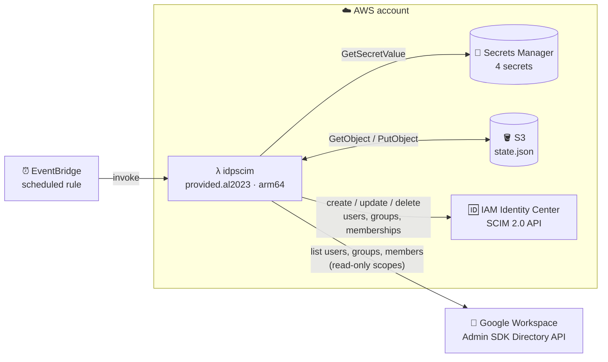
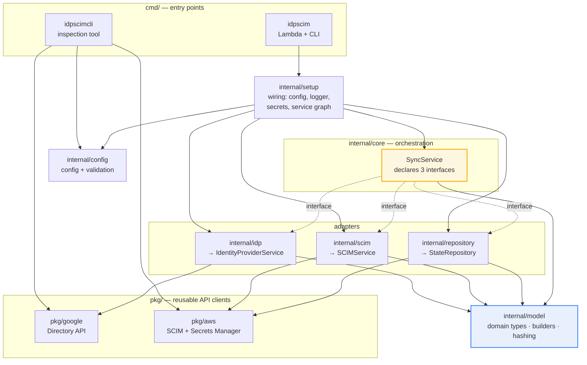
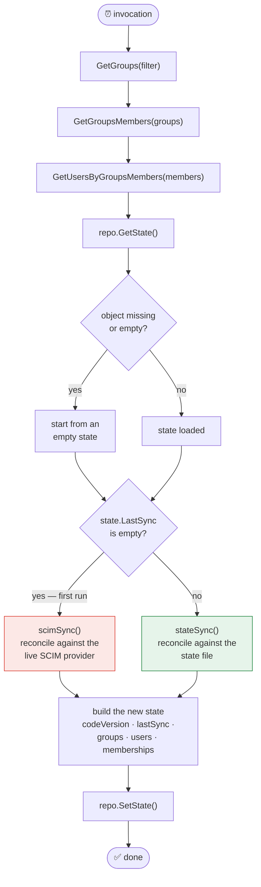
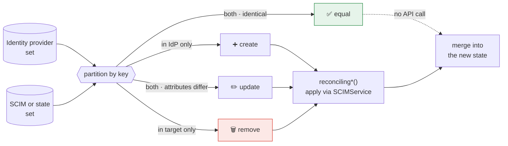
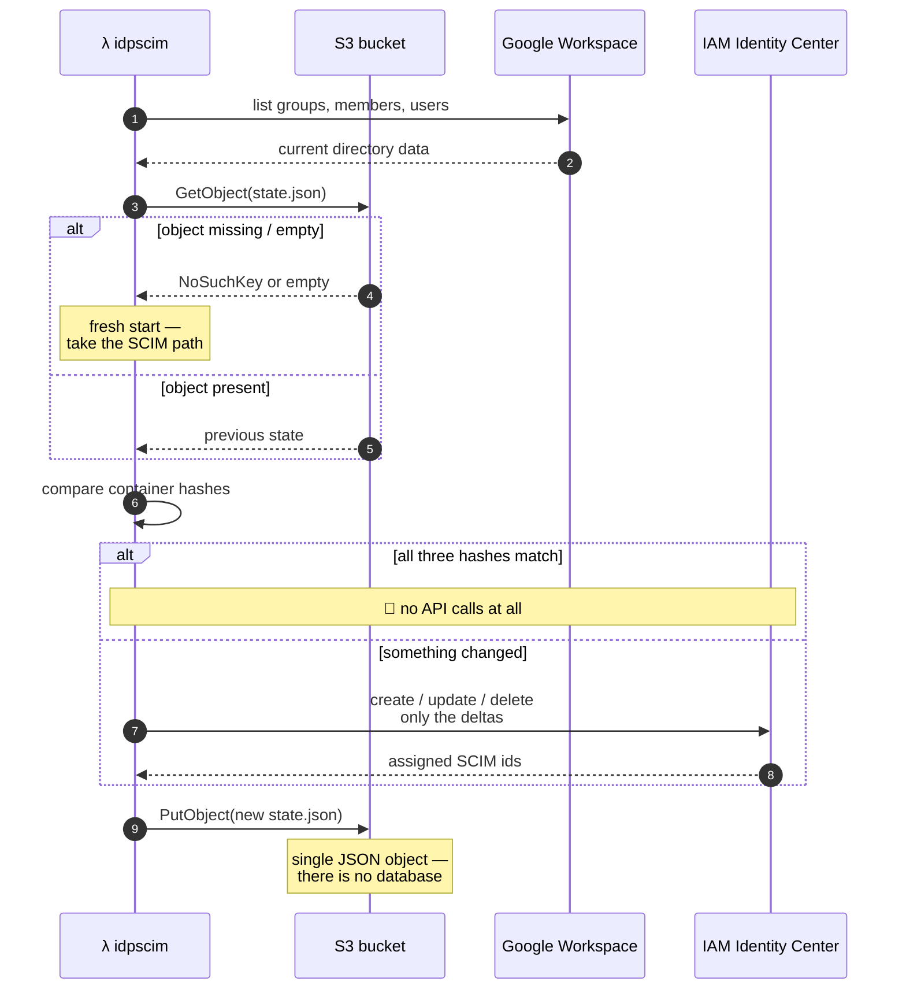
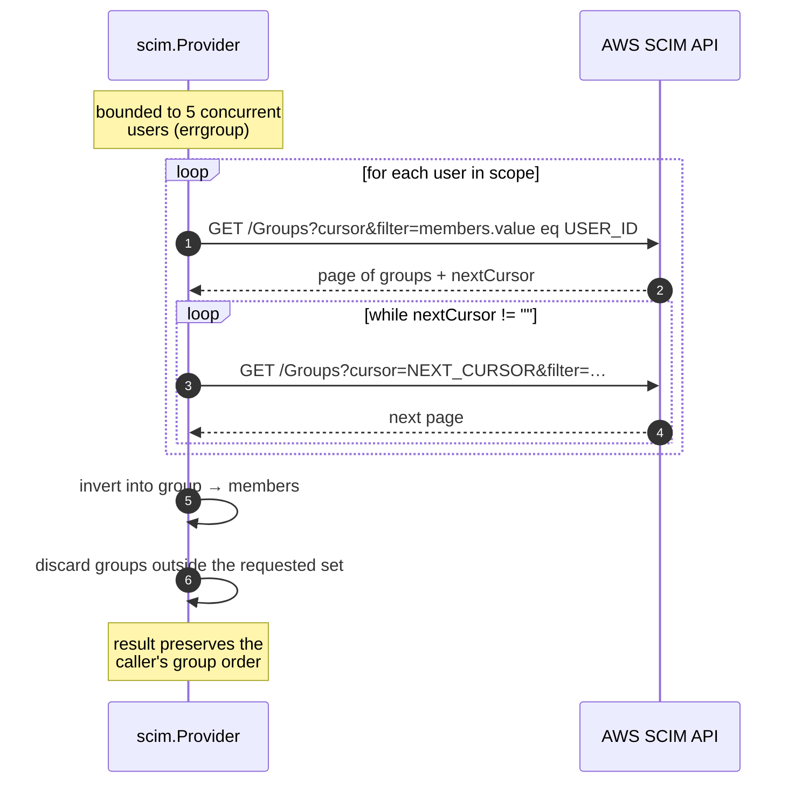

# 🏗️ Architecture

How `idp-scim-sync` is built and why. For *using* it see the
[User Manual](User-Manual.md); for *changing* it see the
[Implementation Guide](Implementation-Guide.md).

---

## 📖 Table of contents

- [System context](#-system-context)
- [Package topology](#-package-topology)
- [The sync algorithm](#-the-sync-algorithm)
- [Reconciliation model](#-reconciliation-model)
- [Hashing and change detection](#-hashing-and-change-detection)
- [State-file lifecycle](#-state-file-lifecycle)
- [Inferring SCIM group membership](#-inferring-scim-group-membership)
- [Concurrency](#-concurrency)
- [Failure modes](#-failure-modes)

---

## 🌐 System context

The Lambda is triggered on a schedule. It reads from Google Workspace, writes to AWS IAM Identity
Center, and keeps a state file in S3 so it can tell what changed since last time.



The direction of authority matters: **Google Workspace is the source of truth**, AWS IAM Identity
Center is the replica, and the state file is only a cache used to avoid re-reading the replica.

| Dependency | Access | Why |
| ---------- | ------ | --- |
| Google Workspace | **read-only** — three `.readonly` scopes | Source of truth; the sync never writes back |
| IAM Identity Center SCIM | read/write | The replica being reconciled |
| S3 | `GetObject`, `PutObject` on one key | State cache |
| Secrets Manager | `GetSecretValue` on four secrets | Credentials and endpoint |

---

## 📦 Package topology

Dependencies point inward toward `internal/model`. `internal/core` is the orchestrator and depends
only on interfaces **it declares itself** — which is what makes the whole thing testable with
generated mocks.



The dotted lines are the important ones. `internal/core` never imports `internal/idp`,
`internal/scim` or `internal/repository`; it declares what it needs and `internal/setup` injects
concrete implementations at startup.

| Interface | Declared in | Implemented by |
| --------- | ----------- | -------------- |
| `IdentityProviderService` | `internal/core/idp.go` | `internal/idp.IdentityProvider` |
| `SCIMService` | `internal/core/scim.go` | `internal/scim.Provider` |
| `StateRepository` | `internal/core/repository.go` | `internal/repository.S3Repository`, `.DiskRepository` |
| `GoogleProviderService` | `internal/idp/idp.go` | `pkg/google.DirectoryService` |
| `AWSSCIMProvider` | `internal/scim/scim.go` | `pkg/aws.SCIMService` |
| `S3ClientAPI` | `internal/repository/repository.go` | `aws-sdk-go-v2` `s3.Client` |
| `HTTPClient` | `pkg/aws/scim.go` | `net/http.Client` |
| `SecretsManagerClientAPI` | `pkg/aws/secretsmanager.go` | `aws-sdk-go-v2` `secretsmanager.Client` |

---

## 🔄 The sync algorithm

`SyncService.SyncGroupsAndTheirMembers` ([internal/core/sync.go](../internal/core/sync.go)) always
reads the identity provider first, then branches on whether a previous run left state behind.



**Why two paths?** The first run cannot trust the state file, so it enumerates the SCIM provider and
adopts what is already there — matching groups by name and users by primary email, and updating only
the `externalId`. That means migrating from another sync tool does **not** delete and recreate
everyone. Later runs skip that enumeration entirely, which is where nearly all the saved API calls
come from.

`stateSync` short-circuits per resource kind
([internal/core/actions.go](../internal/core/actions.go)): if the identity provider's `groups` hash
equals the state's `groups` hash, no group work happens at all — and likewise for users and
memberships, independently.

---

## ⚖️ Reconciliation model

For each resource kind, the identity-provider set and the target set are partitioned into four
buckets ([internal/model/operations.go](../internal/model/operations.go)).



The **matching key** is what makes this safe across two systems that assign their own identifiers:

| Resource | Key | Change detected by |
| -------- | --- | ------------------ |
| Groups | `Name` | `IPID` differs → update |
| Users | primary email address | `HashCode` differs → update |
| Members | `Email` within a group | present / absent only |

Groups are compared on `IPID` rather than a full hash because AWS SCIM does not allow a group's
display name to be changed — only its `externalId` can be patched.

> [!IMPORTANT]
> Because groups are keyed by **name**, two Google groups sharing a name cannot both sync.
> `idp.GetGroups` keeps the first and logs a warning for each duplicate.

---

## 🔐 Hashing and change detection

Every comparison in the system is a hash comparison. Hashes are SHA-256 over a **`gob`** encoding —
not JSON — and each type in `internal/model` hand-writes `MarshalBinary` to control exactly which
fields participate.

```mermaid
sequenceDiagram
    autonumber
    participant B as XxxBuilder()
    participant V as value
    participant H as Hash()
    participant G as gob encoder

    B->>V: WithIPID(…).WithName(…)
    B->>V: Build()
    V->>V: Items = len(Resources)
    V->>V: sort a copy of Resources
    V->>H: Hash(copy)
    H->>G: Encode(copy)
    G->>G: MarshalBinary() per element
    Note over G: only IdP-owned fields;<br/>SCIMID and HashCode excluded
    G-->>H: bytes
    H-->>V: sha256 hex → HashCode
```

Three rules follow, and breaking any of them causes a silent production incident:

1. **`SCIMID` is excluded on purpose.** It is assigned by AWS, not by Google. Including it would make
   every first-run comparison differ, so nothing would ever be seen as unchanged.
2. **The `MarshalBinary` methods are a wire format.** Reordering, adding or removing a field changes
   every hash, invalidating every deployed state file and forcing a full re-sync.
   [`internal/model/golden_hash_test.go`](../internal/model/golden_hash_test.go) pins the current
   values — if it fails, the format moved.
3. **Container hashes must be order-independent.** The `*Result.SetHashCode` methods sort a copy
   before hashing, because the identity-provider fan-outs build their slices from maps. Sorting uses
   `slices.SortStableFunc`, so resources with an identical sort key keep a fixed relative order.

> [!NOTE]
> `State.HashCode` is written into the state file but never read back — only the three container
> hashes drive decisions. It is currently order-dependent; see
> `TestState_hashCodeIsOrderDependent` for the details.

---

## 💾 State-file lifecycle



The state file is a **cache, not a ledger**. Deleting it is safe: the next run takes the first-run
path, re-enumerates the SCIM provider, and adopts the existing population instead of recreating it.
See [State-File-example.md](State-File-example.md) for the serialized form.

---

## 🔍 Inferring SCIM group membership

AWS IAM Identity Center does **not** populate the `members` array on `ListGroups` or `GetGroup`
responses. Membership therefore has to be inferred, and the direction of the query is inverted:
instead of asking each group for its members, each user is asked which groups contain them.



This is **one request per user** (plus one per extra page), replacing an older brute-force approach
that issued one request per *(group, user)* pair. For 200 groups and 500 users that is roughly 500
calls instead of ~100,000.

The bare `?cursor` parameter is required — and must be present even when empty — to switch the AWS
endpoint into cursor-paginated mode, which raises the page cap from 50 to 100 and allows the full
result set to be walked deterministically.

---

## ⚡ Concurrency

Every fan-out uses `errgroup.WithContext` with an explicit limit, sharing one context so the first
failure cancels the rest instead of spending upstream API quota on results that will be discarded.

| Fan-out | Limit | Constant |
| ------- | ----- | -------- |
| `pkg/google.ListGroupMembersBatch` — members per group | 10 | `listGroupMembersBatchConcurrency` |
| `internal/idp.GetUsersByGroupsMembers` — user lookups | 10 | `getUsersConcurrency` |
| `internal/scim.GetGroupsMembers` — membership queries | 5 | `getGroupsMembersConcurrency` |
| `internal/setup.Secrets` — secret reads | 4 (unbounded; there are only four) | — |

The limits are deliberately conservative: both upstream APIs throttle, and a Lambda retry storm
against a throttled SCIM endpoint is worse than a slower sync.

Two ordering consequences are worth knowing:

- `GetUsersByGroupsMembers` collects results from a map, so it sorts by primary email before
  returning. Without that, the state file's `resources` array reshuffled on every run and produced a
  large spurious S3 diff each time.
- `GetGroupsMembers` preserves the caller's group order by writing into a pre-indexed map keyed by
  SCIM id, rather than appending as results arrive.

---

## 🚨 Failure modes

| Situation | Behaviour |
| --------- | --------- |
| Mid-sync failure | The state file is **not** written. Some SCIM mutations may already have been applied; the next run recomputes from scratch and converges. Operations are idempotent by construction. |
| State file missing or empty | Treated as a first run, not an error. `s3types.NoSuchKey` and `repository.ErrStateFileEmpty` are both classified with `errors.AsType`. |
| Google user missing a family name or primary email | `idp.buildUser` rejects the record, logs a warning, and the sync continues without it. AWS SCIM would refuse it anyway. |
| SCIM user with no email | Handled by `scim.memberEmail`, which prefers the primary address and falls back to the first. AWS does return `"emails": []`. |
| Duplicate Google group name | First wins; each duplicate is logged. Groups are keyed by name. |
| 409 Conflict on create | `pkg/aws.CreateOrGetUser` / `CreateOrGetGroup` fetch the existing record instead. If the conflict is on `externalId` with a changed name, they retry **once** with `externalId` cleared, then return `ErrConflictUnresolved`. |
| 404 on delete | Treated as success — already gone, most likely renamed upstream. |
| AWS throttling (429) | The `httpx` client retries with jitter backoff, 10 attempts, 500 ms → 10 s. |
| Google API error mid-fan-out | The shared context is cancelled, sibling requests abort, and the first error propagates. |
| Lambda timeout | Contexts are honoured throughout, so in-flight requests are abandoned rather than left running until the runtime freezes. |

### Attributing a panic to a record

Every bounded fan-out tags its goroutines with `runtime/pprof` labels, and the
sync goroutine itself is tagged too. Go 1.27 prints those labels in traceback
headers, so a panic in CloudWatch names the record that caused it:

```
goroutine 42 [running] {sync: "users", user: "zoe@example.com"}:
```

| Location | Labels |
| -------- | ------ |
| `core.SyncGroupsAndTheirMembers` | `sync=root`, `codeVersion=<version>` |
| `idp.GetUsersByGroupsMembers` | `sync=users`, `user=<email>` |
| `google.ListGroupMembersBatch` | `sync=group-members`, `group=<id>` |
| `scim.GetGroupsMembers` | `sync=scim-group-members`, `user=<scimid>` |

> [!NOTE]
> The labels are set with `pprof.SetGoroutineLabels`, **not** `pprof.Do`.
> `pprof.Do` defers restoring the previous label set, and on a panic those defers
> run during unwinding *before* the runtime prints the traceback — so the labels
> would already be gone. `runtime.Stack` still shows them either way, which makes
> the `pprof.Do` version easy to verify incorrectly.
> `TestGetUsersByGroupsMembers_labelsGoroutinesForTracebacks` guards against the
> substitution. Opt out at runtime with `GODEBUG=tracebacklabels=0`.

---

## 📚 See also

- [Implementation Guide](Implementation-Guide.md) — how to change this code safely
- [User Manual](User-Manual.md) — deploying and operating
- [State-File-example.md](State-File-example.md) — the serialized state
- [AWS-SAM-Template.md](AWS-SAM-Template.md) — the CloudFormation resources
- [Configuration.md](Configuration.md) — every setting
