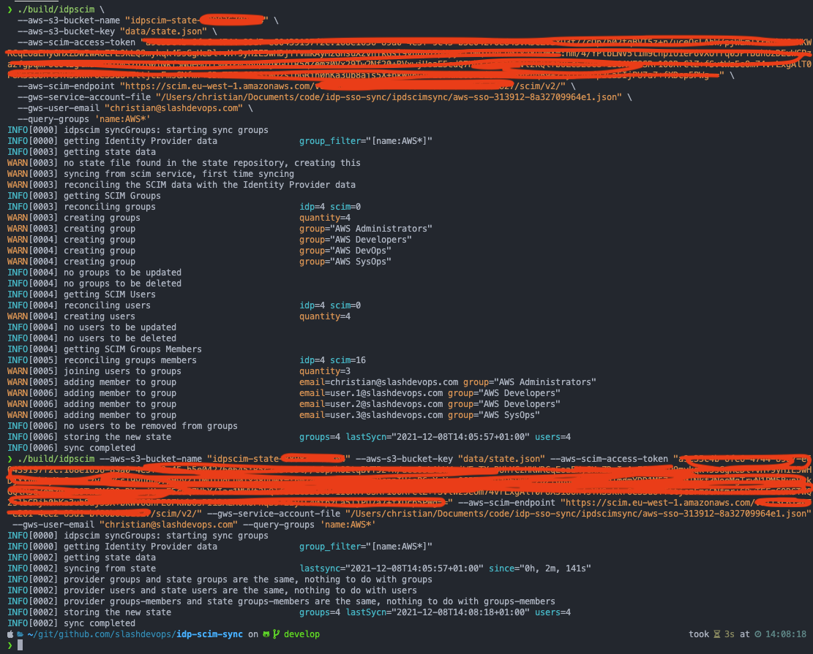
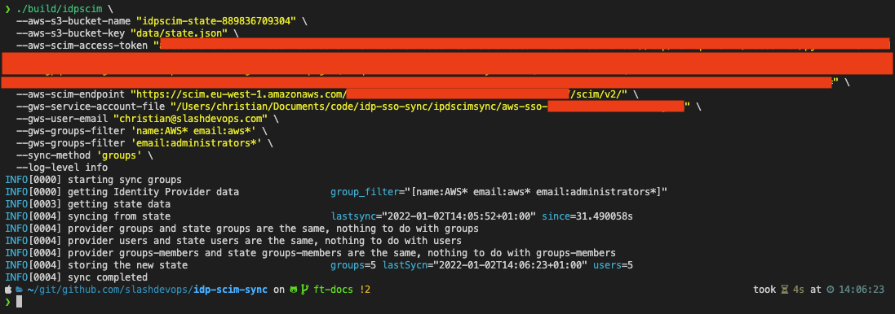
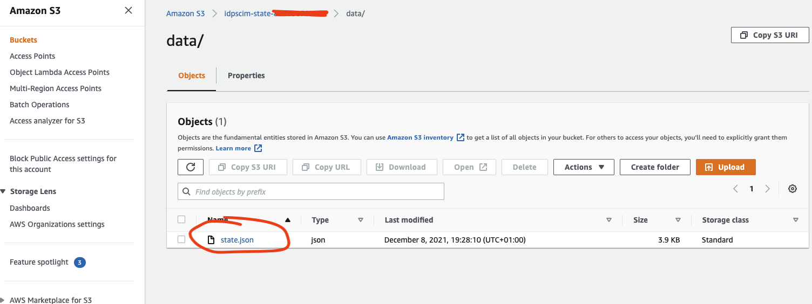
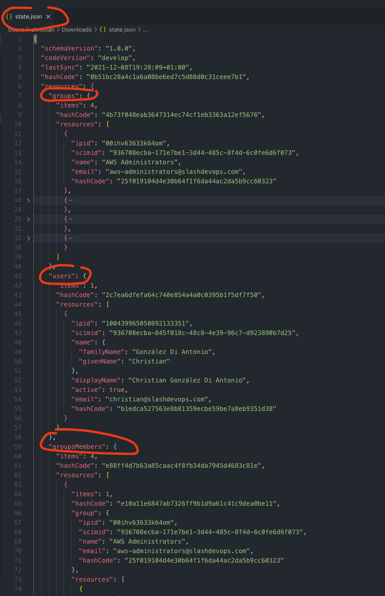
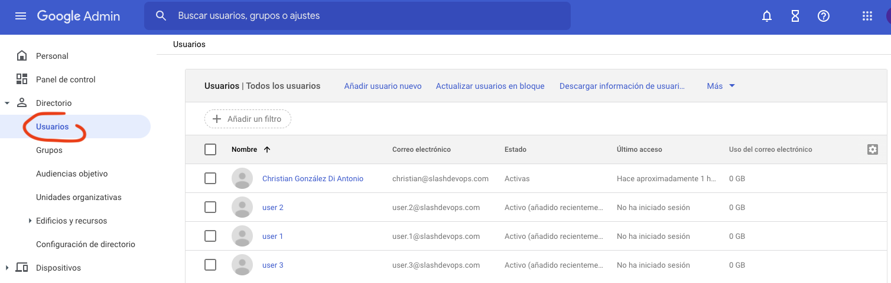
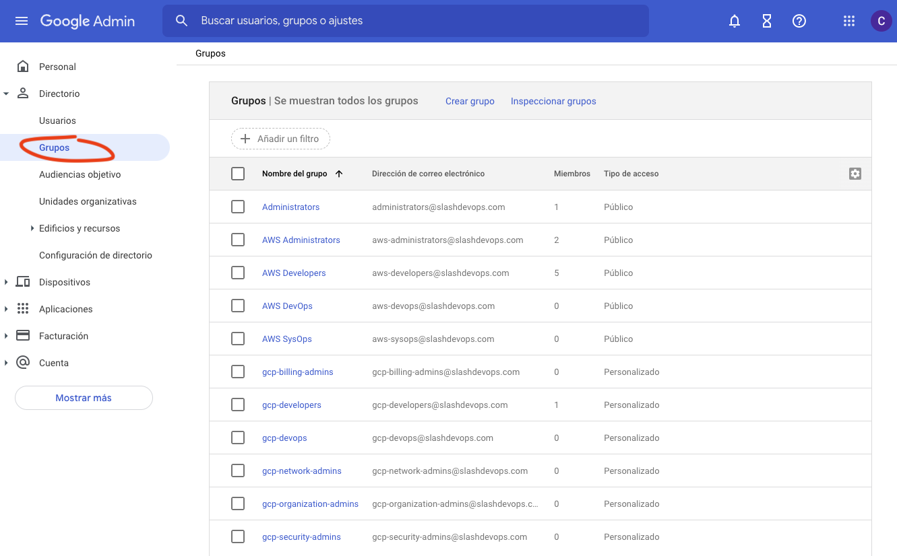
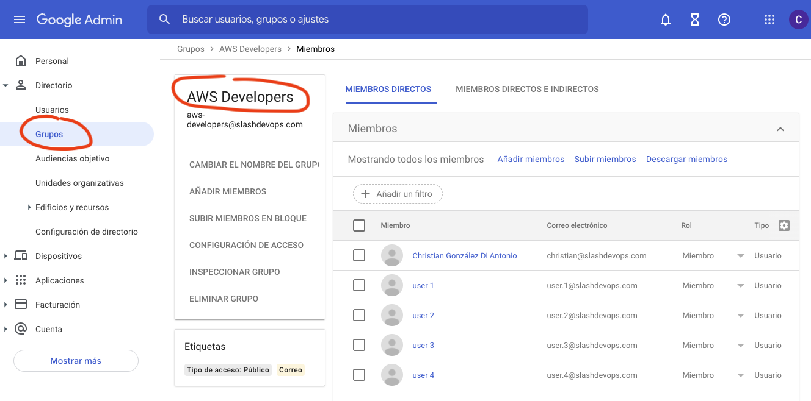
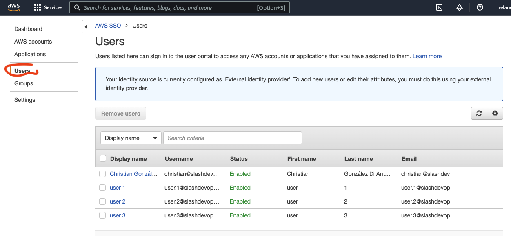
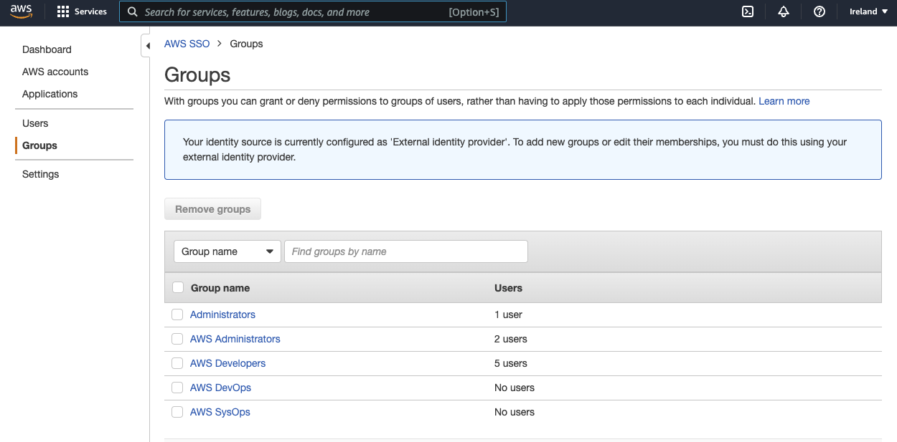
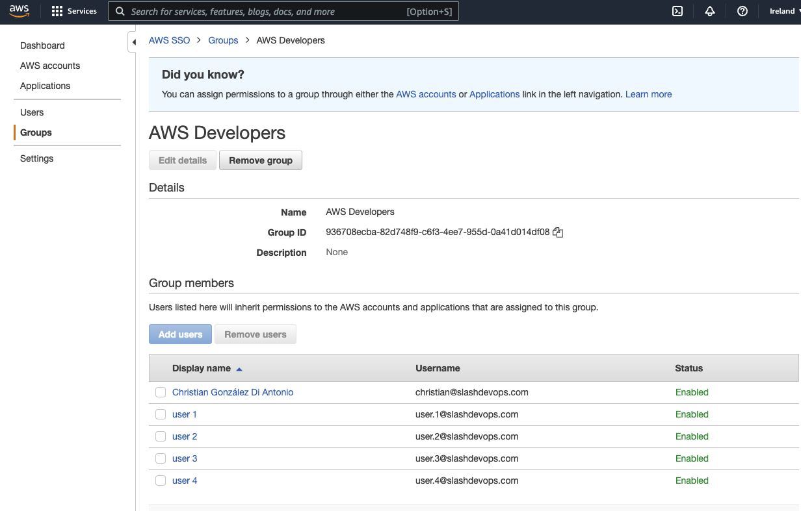

# Demo images

## First time sync

## Sync after first time

## State bucket and file

### AWS Bucket

### State file

## Google Workspace data

### Users

### Groups

### Group Developers

## AWS SSO data

### Users

### Groups

### Group Developers

