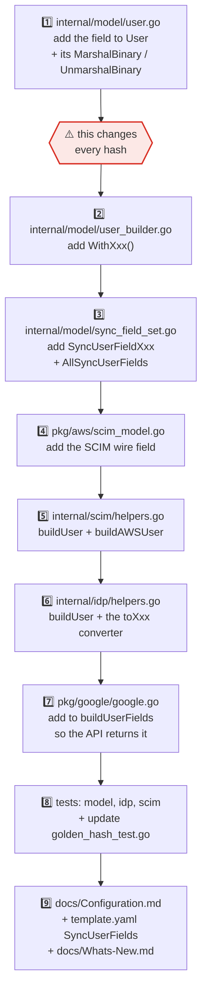

# 🛠️ Implementation Guide

For contributors changing this code. Read [Architecture.md](Architecture.md) first for the shape of
the system, and [Development.md](Development.md) for toolchain setup.

> [!WARNING]
> This project creates, updates and **deletes** real users and groups in a production identity
> provider. A mistake here can revoke someone's access, or fail to revoke access that should have
> been. Correctness outranks elegance.

---

## 📖 Table of contents

- [Repository layout](#-repository-layout)
- [The five invariants](#-the-five-invariants)
- [Adding a synced user attribute](#-adding-a-synced-user-attribute)
- [Interfaces and mocks](#-interfaces-and-mocks)
- [Testing conventions](#-testing-conventions)
- [State-file compatibility](#-state-file-compatibility)
- [The local gate](#-the-local-gate)

---

## 📂 Repository layout

```
cmd/
  idpscim/            Lambda + CLI entry point (cobra)
  idpscimcli/         Inspection CLI for validating config
internal/
  config/             Config struct, defaults, validation
  core/               Orchestration. Declares the 3 service interfaces.
  deepcopy/           Generic slice-of-pointers copy helper
  idp/                Google Workspace adapter → core.IdentityProviderService
  model/              Domain types, builders, hashing  ← the load-bearing package
  repository/         State persistence → core.StateRepository (S3 + disk)
  scim/               AWS SCIM adapter → core.SCIMService
  setup/              Wiring: logger, config, secrets, service graph
  version/            Build-time version vars (set via -ldflags)
pkg/
  aws/                AWS SSO SCIM + Secrets Manager clients
  google/             Google Workspace Directory API client
mocks/                Generated. Never hand-edit.
docs/                 This documentation
```

`pkg/` is importable by third parties; `internal/` is not. Treat `pkg/` signatures as a public API.

---

## 🔒 The five invariants

### 1. Never construct a `model.*` value directly

```go
// ❌ WRONG — HashCode is zero, so this compares unequal to everything and
//    turns a no-op sync into a full rewrite.
g := &model.Group{Name: "developers", IPID: "abc"}

// ✅ RIGHT — Build() sets Items and computes HashCode.
g := model.GroupBuilder().
    WithIPID("abc").
    WithName("developers").
    WithEmail("developers@example.com").
    Build()
```

This applies to `Group`, `User`, `Member`, `GroupMembers`, `State` and every `*Result` type. The one
exception is test fixtures that deliberately assert on unhashed values.

### 2. The `MarshalBinary` methods in `internal/model` are a wire format

Hashing goes through `gob`, and each type hand-writes `MarshalBinary` to control which fields
participate. **Changing field order, adding a field, or removing one changes every hash**, which
invalidates every state file already deployed and forces a full re-sync of every installation.

[`golden_hash_test.go`](../internal/model/golden_hash_test.go) pins ten hash values. If it fails, you
changed the format. That is sometimes correct — but it must be deliberate, and it must be called out
in [Whats-New.md](Whats-New.md).

### 3. `SCIMID` never participates in a hash

It is assigned by AWS, not Google. Including it would make every first-run comparison differ.

### 4. Interfaces are declared by the consumer

`core.SCIMService` lives in `internal/core`, not `internal/scim`. Don't "tidy" these next to their
implementations — the current arrangement is why every package can be tested with generated mocks and
why `internal/core` has no AWS or Google imports.

### 5. `internal/core` must not import concrete AWS or Google types

If you find yourself needing `s3types` or `admin.User` inside `internal/core`, the type belongs in
`internal/model` or the logic belongs in an adapter.

---

## ➕ Adding a synced user attribute

This is the most common change and the easiest to get half-right. Every step is required.



Notes on the easy-to-miss steps:

- **Step 5** is one function, not two. `buildAWSUser` serves both `CreateUserRequest` and
  `PutUserRequest`, which are both declared as `type X User`. Before that was unified, a new
  attribute could be added to creates and forgotten in updates, making the two disagree with nothing
  to catch it.
- **Step 7** matters for cost and correctness: the Google client requests an explicit field mask, so
  an attribute you don't add there simply never arrives, and step 6 will silently see a zero value.
- **Step 8**: `golden_hash_test.go` *will* fail after step 1. Regenerate the constants deliberately
  and note the re-sync consequence in the PR.

The `SyncFieldSet` mechanism means an attribute can be enabled or disabled per deployment. An empty
set means "all attributes", which is the backward-compatible default — so don't add a field that is
only correct when explicitly enabled.

---

## 🎭 Interfaces and mocks

Mocks are generated by `mockgen` via the `tool` directive in `go.mod`. The directives live next to
each interface:

```go
//go:generate go tool mockgen -package=mocks -destination=../../mocks/core/scim_mocks.go -source=scim.go
```

After **any** change to a consumed interface:

```bash
make go-generate
```

Never hand-edit anything under `mocks/`. If a mock looks wrong, the interface or the directive is
wrong.

---

## 🧪 Testing conventions

**Bug fixes and refactors start with a failing test.** Write the red test, confirm it fails, then
make it green, and put the failing output in the PR description.

For a *pure* refactor there is no bug to reproduce. Write a **characterization test** that pins the
existing contract instead, confirm it passes before the change, and confirm it still passes after —
don't manufacture a fake red. `internal/scim/build_request_test.go` is the worked example: it asserts
the create and put requests are field-for-field identical apart from `ID`, which is exactly the
property the de-duplication had to preserve.

| Convention | Detail |
| ---------- | ------ |
| Table-driven | `tests := []struct{ name string; … }` with `t.Run(tt.name, …)` |
| Fixtures | JSON under `testdata/`, loaded with a helper |
| Race detector | Mandatory. `make test` already passes `-race`. |
| Environment | `t.Setenv`, never `os.Setenv` — see below |
| Temp files | `t.TempDir()`, never `os.TempDir()` — see below |
| Concurrency | `testing/synctest` for deterministic fake-time tests of bounded fan-outs |
| Fuzzing | New parsing or decoding paths get a `Fuzz*` target. `FUZZ_TIME=30s make fuzz`. |
| Hashing | Any change touching `internal/model` must keep `golden_hash_test.go` green |

> [!CAUTION]
> **Use `t.Setenv` and `t.TempDir()`.** Three subtests in `pkg/aws/config_test.go` once passed only
> because `os.Setenv` leaked `AWS_ACCESS_KEY_ID` between them — they asserted credentials came from
> the environment while their own setup pointed at a credentials file. And two tests called
> `os.Remove(os.TempDir())`, attempting to delete the shared system temp directory; it failed
> silently only because `/tmp` is never empty.
>
> A useful check: every subtest should pass when run **individually**, not just as part of the file.
>
> ```bash
> go test -run 'TestName/subtest_name' ./pkg/aws/
> ```

---

## 💾 State-file compatibility

The state file is a cache, but it is a cache with a schema, and installations upgrade in place.

**Safe** — no re-sync triggered:

- Adding a field that is *not* encoded in a `MarshalBinary` method
- Changing log messages, comments, or error text
- Changing concurrency limits
- Changing the *order* of elements in a result slice (the container hashes sort before hashing)

**Forces a full re-sync** — must be deliberate and documented:

- Any change to a `MarshalBinary` / `UnmarshalBinary` method in `internal/model`
- Adding, removing or reordering a hashed field
- Changing what `SetHashCode` excludes

**Requires a `StateSchemaVersion` bump and a migration note:**

- Renaming or removing a JSON field in the serialized state
- Changing a field's JSON type

> [!TIP]
> Deleting the state file is always safe. The next run takes the first-run path, re-enumerates the
> SCIM provider, and **adopts** the existing population rather than recreating it — matching groups
> by name and users by primary email. That is the recovery path for any state corruption, and it is
> also why migrating from another sync tool doesn't churn every user.

---

## ✅ The local gate

Run all of it before pushing:

```bash
go fix ./...            # Go 1.27+ modernizers
make go-fmt             # Format
make go-betteralign     # Struct field alignment
golangci-lint run ./... # Must report 0 issues
make build              # Verify build
make test               # Full -race suite
```

Plus, when relevant:

```bash
FUZZ_TIME=30s make fuzz                              # parsing/decoding changes
go run golang.org/x/vuln/cmd/govulncheck@latest ./... # dependency changes
make go-generate                                     # interface changes
```

`golangci-lint` is configured by the committed [`.golangci.yml`](../.golangci.yml), so local and CI
results agree. **The baseline is 0 issues** — any finding is yours.

---

## 📚 See also

- [Architecture.md](Architecture.md) — how the system fits together
- [Development.md](Development.md) — toolchain and environment setup
- [Configuration.md](Configuration.md) — every setting
- [State-File-example.md](State-File-example.md) — the serialized state
- [Release.md](Release.md) — release process
- [CONTRIBUTING.md](../CONTRIBUTING.md) — DCO, PR expectations
