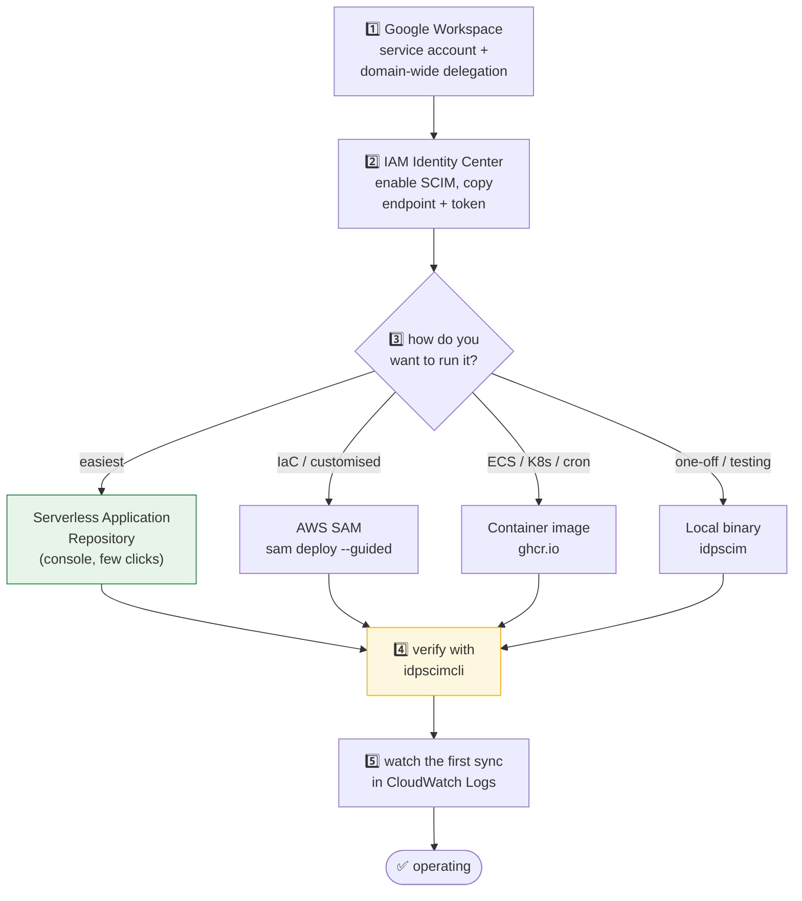

# 📘 User Manual

End-to-end guide to deploying and operating `idp-scim-sync`. It stitches together the setup path and
links to the detailed references rather than duplicating them.

New to AWS IAM Identity Center? Read [Using-SSO.md](Using-SSO.md) first.

---

## 📖 Table of contents

- [What it does](#-what-it-does)
- [Prerequisites](#-prerequisites)
- [Setup path](#-setup-path)
- [1. Google Workspace](#1️⃣-google-workspace)
- [2. AWS IAM Identity Center](#2️⃣-aws-iam-identity-center)
- [3. Deploy](#3️⃣-deploy)
- [4. Verify](#4️⃣-verify-with-idpscimcli)
- [Operating](#-operating)
- [Troubleshooting](#-troubleshooting)
- [Upgrading and rolling back](#-upgrading-and-rolling-back)

---

## ✨ What it does

Google Workspace groups and users are replicated into AWS IAM Identity Center on a schedule
(default: every 15 minutes). **Google Workspace is the source of truth** — the sync only ever reads
from it, using read-only scopes, and only ever writes to AWS.

| | |
| --- | --- |
| 🎯 Scope | Groups matching your filter, their members, and the users behind those members |
| 🔒 Google access | Read-only (three `.readonly` scopes) |
| ✍️ AWS access | Create, update and delete users, groups and memberships |
| 💾 State | One JSON object in S3 — no database |
| ⏱️ Cadence | EventBridge schedule, default `rate(15 minutes)` |

---

## 📋 Prerequisites

- A Google Workspace tenant with **super-admin** access (needed once, to authorize domain-wide
  delegation)
- An AWS account with **IAM Identity Center enabled** and **automatic provisioning (SCIM) turned on**
- Permission to deploy CloudFormation / SAM in that account
- For local runs only: Go 1.27+ and the AWS CLI

---

## 🗺️ Setup path



---

## 1️⃣ Google Workspace

You need a **service account** with **domain-wide delegation**, authorized for three read-only
scopes.

1. In the Google Cloud console, create a project (or reuse one) and enable the **Admin SDK API**.
2. Create a service account and download its **JSON key**. This file is the credential the sync uses;
   treat it like a password.
3. Note the service account's **Client ID** (numeric, on the service-account details page).
4. In the **Google Workspace Admin console** → Security → Access and data control → **API controls**
   → **Domain-wide delegation** → **Add new**, enter that Client ID and these scopes:

   ```
   https://www.googleapis.com/auth/admin.directory.group.readonly
   https://www.googleapis.com/auth/admin.directory.group.member.readonly
   https://www.googleapis.com/auth/admin.directory.user.readonly
   ```

5. Choose the **Workspace admin email** the service account will impersonate. Domain-wide delegation
   acts *as* a user, so this address must have directory read permission.

> [!IMPORTANT]
> Keep the JSON key outside your repository and outside any directory you tar or share. If it ever
> leaks, revoke the key in the Cloud console — rotating it does not require redeploying, only
> updating the secret.

---

## 2️⃣ AWS IAM Identity Center

1. Enable IAM Identity Center in your chosen region.
2. Settings → **Automatic provisioning** → **Enable**.
3. Copy the **SCIM endpoint** (like `https://scim.<region>.amazonaws.com/<id>/scim/v2/`) and generate
   an **access token**.

> [!CAUTION]
> The SCIM access token is shown **once**. Store it immediately. Tokens expire — note the expiry and
> set a reminder, because an expired token fails every sync with 401 until rotated.

Detail: [Using-SSO.md](Using-SSO.md).

---

## 3️⃣ Deploy

Four supported options. All read the same configuration — see
[Configuration.md](Configuration.md) for every setting.

### Option A — Serverless Application Repository (easiest)

Deploy from the AWS console's Serverless Application Repository. It provisions the Lambda, the S3
state bucket, a KMS key, the four Secrets Manager secrets, the IAM role, the log group and the
EventBridge schedule. Fill in the parameters and go.

### Option B — AWS SAM (recommended for IaC)

```bash
git clone https://github.com/slashdevops/idp-scim-sync.git
cd idp-scim-sync
sam build
sam deploy --guided
```

Full parameter reference: [AWS-SAM.md](AWS-SAM.md) and
[AWS-SAM-Template.md](AWS-SAM-Template.md).

Defaults worth knowing:

| Parameter | Default | Note |
| --- | --- | --- |
| `ScheduleExpression` | `rate(15 minutes)` | Any EventBridge schedule expression |
| `BucketKey` | `data/state.json` | The code default is `state.json`; the template overrides it |
| `Runtime` | `provided.al2023` | |
| `Architecture` | `arm64` | Graviton — cheaper and faster here |
| `SyncMethod` | `groups` | The only implemented method |
| `SyncUserFields` | *(empty)* | Empty means **all** optional attributes |

### Option C — Container image

```bash
podman run --rm \
  -e IDPSCIM_GWS_USER_EMAIL="admin@example.com" \
  -e IDPSCIM_GWS_SERVICE_ACCOUNT_FILE="/app/credentials.json" \
  -e IDPSCIM_AWS_SCIM_ENDPOINT="https://scim.eu-west-1.amazonaws.com/.../scim/v2/" \
  -e IDPSCIM_AWS_SCIM_ACCESS_TOKEN="..." \
  -e IDPSCIM_AWS_S3_BUCKET_NAME="my-state-bucket" \
  -v /secure/path/credentials.json:/app/credentials.json:ro \
  ghcr.io/slashdevops/idp-scim-sync:latest \
  /app/idpscim
```

### Option D — Local binary

Download a release binary or `make build`, then:

```bash
./build/idpscim \
  --gws-user-email admin@example.com \
  --gws-service-account-file /secure/path/credentials.json \
  --aws-scim-endpoint 'https://scim.eu-west-1.amazonaws.com/.../scim/v2/' \
  --aws-scim-access-token '...' \
  --aws-s3-bucket-name my-state-bucket \
  --gws-groups-filter 'name:AWS*' \
  --log-level debug
```

Command reference: [idpscim.md](idpscim.md).

---

## 4️⃣ Verify with `idpscimcli`

Before letting the sync write anything, confirm both sides are reachable and your filter selects what
you expect. `idpscimcli` is **read-only**.

```bash
# Which Google groups does my filter actually match?
idpscimcli gws groups list \
  --gws-user-email admin@example.com \
  --gws-service-account-file /secure/path/credentials.json \
  --gws-groups-filter 'name:AWS*'

# And their members?
idpscimcli gws groups members list \
  --gws-user-email admin@example.com \
  --gws-service-account-file /secure/path/credentials.json \
  --gws-groups-filter 'name:AWS*'

# Is the SCIM endpoint reachable and the token valid?
idpscimcli aws service config \
  --aws-scim-endpoint 'https://scim.eu-west-1.amazonaws.com/.../scim/v2/' \
  --aws-scim-access-token '...'

# What is already on the AWS side?
idpscimcli aws groups list --aws-scim-endpoint '...' --aws-scim-access-token '...'
idpscimcli aws users list  --aws-scim-endpoint '...' --aws-scim-access-token '...'
```

Full command tree: [idpscimcli.md](idpscimcli.md).

> [!TIP]
> Groups are matched **by name**. If your filter returns two groups with the same name, only the
> first syncs and the rest are logged as warnings. Check for duplicates here, before the first run.

---

## 🔧 Operating

### The first run is the expensive one

It enumerates the entire SCIM population to adopt what is already there, then writes the state file.
Every later run compares hashes and typically issues **no writes at all**. If you are migrating from
another sync tool, this is what prevents everyone being deleted and recreated: groups are matched by
name and users by primary email, and only `externalId` is updated.

### What to watch

| Signal | Where | Healthy |
| --- | --- | --- |
| `sync groups completed` + duration | CloudWatch Logs | Every scheduled run |
| Lambda errors | CloudWatch metrics | Zero |
| Lambda duration | CloudWatch metrics | Well under the configured timeout |
| State object `LastModified` | S3 | Updated each run |

Set `log_format: json` in Lambda so Logs Insights can query the structured fields:

```
fields @timestamp, msg, groups, users
| filter msg = "sync groups completed"
| sort @timestamp desc
```

### The state file

One JSON object at `s3://<bucket>/<key>`. It is a **cache, not a ledger**. Inspect it with:

```bash
aws s3 cp s3://my-state-bucket/data/state.json - | jq '{lastSync, codeVersion, groups: .resources.groups.items, users: .resources.users.items}'
```

Deleting it is safe — see [Troubleshooting](#-troubleshooting). Format:
[State-File-example.md](State-File-example.md).

### Changing which attributes sync

`SyncUserFields` selects optional user attributes. Empty means **all** of them. Valid values:

`phoneNumbers`, `addresses`, `title`, `preferredLanguage`, `locale`, `timezone`, `nickName`,
`profileURL`, `userType`, `enterpriseData`

Narrowing it also narrows what is requested from the Google API, so it reduces data transfer as well
as what lands in AWS. Changing it changes user hashes, so the next run updates every user once.

---

## 🚑 Troubleshooting

| Symptom | Likely cause | What to do |
| --- | --- | --- |
| `401` from the SCIM endpoint | Access token expired or wrong | Regenerate in IAM Identity Center, update the `IDPSCIM_SCIMAccessToken` secret. No redeploy needed. |
| `403` from Google | Domain-wide delegation not authorized, or a scope missing | Re-check all three scopes against the service account's Client ID in the Admin console |
| `unable to impersonate` | The impersonated admin lacks directory read rights | Use an account with directory read permission |
| No groups found | Filter matches nothing | Test the filter with `idpscimcli gws groups list` |
| A group is skipped with a warning | Duplicate group name | Groups are keyed by name; make names unique |
| A user never appears in AWS | Google record missing a family name or primary email | The record is rejected and logged at `warn`; AWS SCIM would refuse it too. Fix it in Google. |
| `429` from AWS | Throttling | Handled automatically with jitter backoff (10 attempts). Persistent 429s mean the schedule is too aggressive for the directory size. |
| Lambda times out | Directory too large for the timeout | Raise the `Timeout` parameter. The first run is the slow one; later runs are much faster. |
| Sync appears to do nothing | Nothing changed upstream | Correct behaviour. Confirm with `log_level: debug` — you'll see the hash comparisons short-circuiting. |
| Everything re-syncs after an upgrade | The release changed hashing or state-file ordering | Expected once; [Whats-New.md](Whats-New.md) calls it out when it happens |
| State file looks corrupt | Partial write or manual edit | **Delete it.** The next run re-enumerates AWS and adopts the existing population. This is the standard recovery. |

### Getting more detail

```bash
# Locally
idpscim --debug ...

# In Lambda: set LogLevel to debug, redeploy, and revert afterwards —
# debug logs every group and user.
```

---

## ⬆️ Upgrading and rolling back

1. Read [Whats-New.md](Whats-New.md) for the target version. It flags anything that forces a
   re-sync or changes the state-file schema.
2. Deploy the new version (`sam deploy`, or update the SAR/container version).
3. Watch the first run. A one-off larger-than-usual set of updates is normal when a release changes
   hashing or element ordering.

**Rolling back:** deploy the previous version. If the newer version changed the state-file schema,
delete the state object as well so the older code takes the first-run path rather than misreading a
newer schema.

Compatibility:

| Version range | Runtime | Architecture |
| --- | --- | --- |
| `<= v0.0.18` | `go1.x` | amd64 |
| `>= v0.0.19 < v0.31.0` | `provided.al2` | arm64 |
| `>= v0.31.0` | `provided.al2023` | arm64 |

---

## 📚 See also

- [Configuration.md](Configuration.md) — every setting, env var and flag
- [idpscim.md](idpscim.md) · [idpscimcli.md](idpscimcli.md) — command references
- [AWS-SAM.md](AWS-SAM.md) · [AWS-SAM-Template.md](AWS-SAM-Template.md) — deployment
- [Using-SSO.md](Using-SSO.md) — IAM Identity Center basics
- [Architecture.md](Architecture.md) — how it works internally
- [Demo.md](Demo.md) — annotated walkthrough with screenshots
